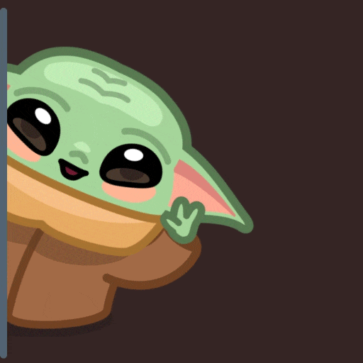

### Olá me chamo Jonathan, Seja bem vindo ao meu Github👋
### faça um tour pelos meus projetos.
## 

    
 

 

   
 ## 🖥️ Back-End
    
 

 

    <!---->
     &ensp;
     &ensp;
     &ensp;
     &ensp;
     &ensp;
    

 

    
 ## 🖥️ Front-End
    

<!--     <code></code> -->
    &ensp;
    &ensp;
    &ensp;
   &ensp;
    

 

    
## 🛠️ Ferramentas

 
     &ensp;
     &ensp;
     &ensp;
     &ensp;
     &ensp;
     &ensp;
     &ensp;
      

 
<!--

 

-->
<!--
**JonathanSRS/JonathanSRS** is a ✨ _special_ ✨ repository because its `README.md` (this file) appears on your GitHub profile.

Here are some ideas to get you started:

- 🔭 I’m currently working on ...
- 🌱 I’m currently learning ...
- 👯 I’m looking to collaborate on ...
- 🤔 I’m looking for help with ...
- 💬 Ask me about ...
- 📫 How to reach me: ...
- 😄 Pronouns: ...
- ⚡ Fun fact: ...
-->
